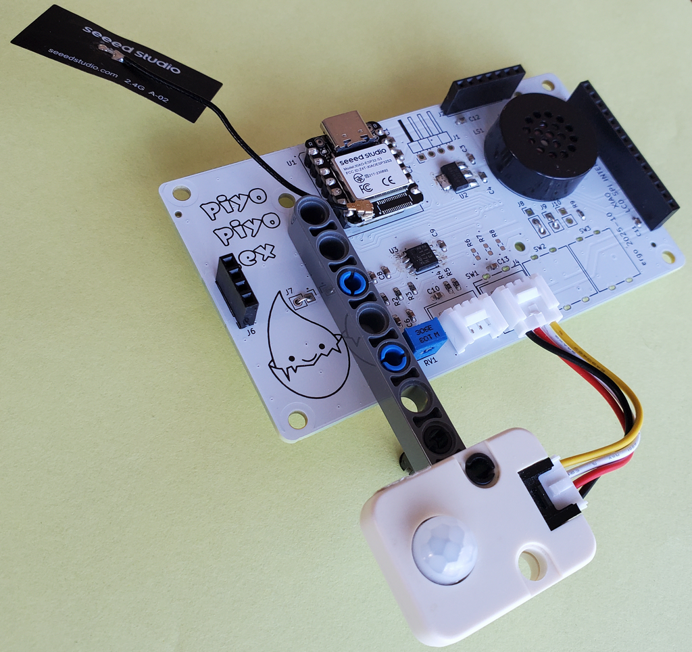

# Piyopiyo PCB

Piyopiyo PCB は、Elixir 初学者コミュニティ
[piyopiyo.ex](https://piyopiyoex.connpass.com/) のためのオリジナル基板です。
ワークショップや自習で扱いやすく、回路やソフトウェアも後から読み解きやすい構成を目指しています。

  

## ハードウェア

ハードウェア設計データの概要や各ファイルの用途は、
[`hardware/README.md`](./hardware/) を参照してください。

  

## Attribution & Licensing

- ハードウェア設計（`hardware/`）: [kurokouji](https://github.com/kurokouji)
- `hardware/` は CERN-OHL-P-2.0、`manuals/` / `media/` / `.md` は原則 CC BY 4.0
- ライセンスの詳細: [`LICENSE.md`](./LICENSE.md)
